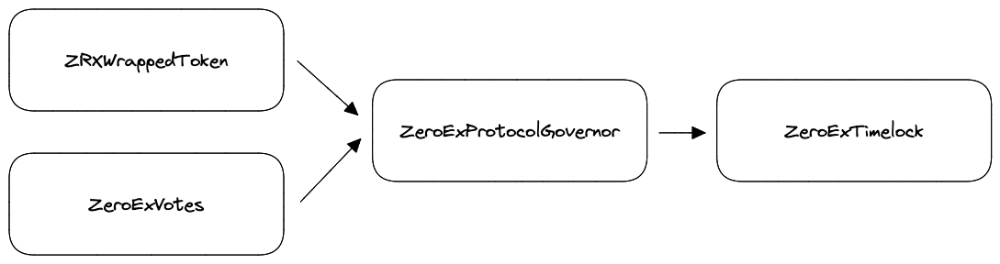

###############################
Governance System
###############################

.. note::

    This page is tailored for Exchange V4. For information on governance over past exhcange versions, see `this specification <https://github.com/0xProject/0x-protocol-specification/blob/master/v3/zero-ex-governor.md>`_.

There are two governance systems within 0x Protocol - ``ZeroExProtocolGovernor`` governs the ``ZeroEx`` exchange proxy contract and ``ZeroExTreasuryGovernor`` governs the ``ZrxTreasury`` contract. Both of these systems leverage the same structure and base contracts such as ``ZeroExVotes`` with some slight differences described below.

The governance system that has permission to perform administrative functions within the ``ZeroEx`` exchange proxy and ``ZrxTreasury`` contract is  comprised of a set of smart contracts that can collectively be found `here <https://github.com/0xProject/protocol/contracts/governance>`_. 

This is enabled via a Compound-like governor design with snapshotting, delegation, and upgradeable vote tallying capacity. All meta governance variables such as Voting Delay, Voting Period, Quorum, Timelock, etc. can be subject to change via governance.

All updates are timelocked (see below) and a 0x Protocol Security Council is introduced that allows a multisig comprised of elected members to mitigate damage in case of emergencies (for example, if a vulnerability is deiscovered that puts user funds at risk) without a timelock. Note: *once the security council exercise its power to cancel an active proposal or rollback the protocol to an earlier version, their permissions are removed and a new council needs to be reelected and assigned.*

Proposals
=========

The core type of action in 0x Protocol governance is the creation, discussion, and decision making on proposals. Proposals are open-ended sets of instructions that, when executed, can result in a wide range of outcomes from the deployment and extension of ``ZeroEx`` exchange proxy to the disbursement of funds from the ``ZrxTreasury`` to a recipient. 

Below is a simple flow chart of the full life cycle of proposal for both the protocol and treasury.

.. image:: ../static/img/proposal_process.png
    :align: center
    :scale: 100%

The one difference between protocol and treasury proposals is that protocol proposals involve a formal `ZEIP PR <https://github.com/0xProject/ZEIPs/issues>`_ and technical development.

**Creating a Proposals**

Call ``propose()`` to create a new proposal which consists of four components and returns ``proposalId``. A history of all proposals are stored within the respective ``ZeroExProtocolGovernor`` and ``ZeroExTreasuryGovernor`` contracts.

.. code-block:: solidity

    /// @dev creates an on-chain proposal
    /// @param targets Array of addresses of the target contract
    /// @param values Array of amount of ETH attached with each calldata
    /// @param calldata Array of bytes that define the encoded function call
    /// @param description Human readable description of the proposal

    function propose(
        address[] targets
        uint256[] values,
        bytes[] calldatas,
        string description
    ) public returns (uint256 proposalID);

**Voting on Proposals**

Call ``castVote()`` to vote on an active proposal and returns ``balance``. All proposals within 0x protocol governance are simple polls, i.e. are three options: Yes, No, and Abstain.

.. code-block:: solidity

    /// @dev cast a vote
    /// @param proposalID unint256 that represents a given proposal
    /// @param support uint8 that define a user's choice; [0, 1, 2] = ["Abstain", "For", "Against"]

    function castVote(
        uint256 proposalId
        uint8 support
    ) public returns (uint256 balance);

**Executing a Proposal**

Successful proposals must go through a timelock first before execution which is accomplished in two steps: call ``queue()`` which will add the proposal to ``ZeroExTimelock`` and then ``execute()``.

.. code-block:: solidity

    /// @param targets Array of addresses of the target contract
    /// @param values Array of amount of ETH attached with each calldata
    /// @param calldata Array of bytes that define the encoded function call
    /// @param description Human readable description of the proposal
    
    /// @dev queue a successful proposal to the timelock contract
    function queue(
        address[] targets,
        uint256[] values,
        bytes[] calldata,
        bytes32 descriptionHash
    ) public returns (uint256)

    /// @dev execute a successful proposal that has been held in the timelock contract for the appropriate amount of time
    function execute(
        address[] targets,
        uint256[] values,
        bytes[] calldatas,
        bytes32 descriptionHash
    ) public

Timelocks
============
All proposals passed through governance follow a 2 day timelock before they can be executed.

The exception to this timelock are the actions taken by the Security Council.

Security Council
================

0x Protocol Governance system features an elected Security Council that has limited emergency administrative power over ``zeroEx`` exchange proxy and ``ZrxTreasury``. The Security Council is represented as a Gnosis multisig comprised of 5 elected members that requires 3/5 to take action.

The Security Council implementation can be found `here <https://github.com/0xProject/protocol/blob/fae858183a37e68e5f7de8f852280f0297a958a4/contracts/governance/src/ISecurityCouncil.sol>`_.

There are two actions that the Security Council can take: ``cancel()`` and ``executeRollback()``. Once the Security Council takes an action, the current members will be immediately ejected and a new council will need to be elected. Until a new council is appointed, while existing active proposals can be voted on, no new proposals can be created nor queued nor executed. 

.. code-block:: solidity

    /// @param targets Array of addresses of the target contract
    /// @param values Array of amount of ETH attached with each calldata
    /// @param calldata Array of bytes that define the encoded function call
    /// @param description Human readable description of the proposal

    ///@dev cancel existing proposal
    function cancel(
        address[] memory targets,
        uint256[] memory values,
        bytes[] memory calldatas,
        bytes32 descriptionHash
    ) public virtual;

    ///@dev instantly execute rollbacks via the timelock controller
    function executeRollback(
        address[] memory targets,
        uint256[] memory values,
        bytes[] memory calldatas,
        bytes32 descriptionHash
    ) public;

**Assigning a Security Council**

To assign a new Security Council, a proposal needs to be created

.. code-block:: solidity

    ///@dev assign security council address. Only the governor can assign a security council
    ///@param _securityCouncil address of gnosis multisg 

    function assignSecurityCouncil(
        address _securityCouncil
    ) public onlyGovernnace

Meta Governance variables
=========================
Below is a table that describes the meta governance variablesa and their current values.

``ZeroExTreasuryGovernor``
.. csv-table::
    :header: "Variable", "Description", "Timelock"
    
    ``votingDelay``,  2 days
    ``votingPeriod``,7 days
    ``proposalThreshold``, 500*10**18
    ``quorum``, 10% of voting supply
    ``timelock``, 2 days

``ZeroExProtocolGovernor``
.. csv-table::
    :header: "Variable", "Description", "Timelock"

    ``votingDelay``,  2 days
    ``votingPeriod``,7 days
    ``proposalThreshold``, 10**6*10**18
    ``quorum``, 10**7*10**18
    ``timelock``, 3 days